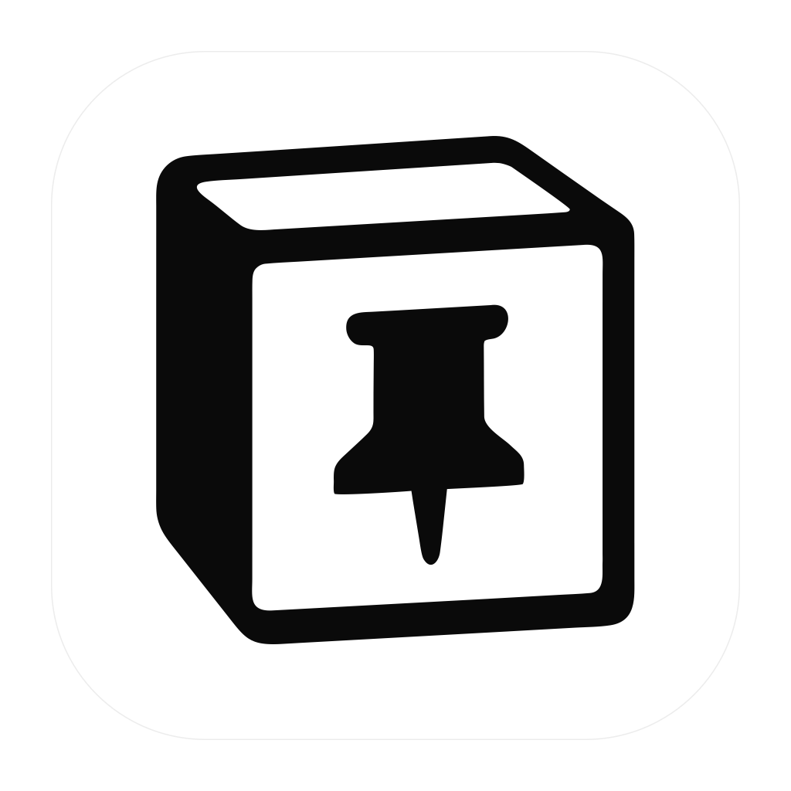

# NotionPin



[English](#english) | [中文](#中文)

NotionPin is a small, always-on-top macOS window for viewing and editing tasks stored in a Notion database. It is free and open source, has no account server, and connects directly from the desktop app to the Notion API.

> NotionPin is an independent open-source project and is not affiliated with or endorsed by Notion Labs, Inc.

## English

### Features

- Always-on-top, collapsible task window
- Notion database connection with explicit field mapping
- Task filtering by status
- Inline title, status, and due-date editing
- Local token storage through the operating system's secure storage
- No billing, subscriptions, analytics, telemetry, or hosted backend

### Download

Open the repository's [Releases](https://github.com/crazzzzhao/notionpin/releases) page and download the DMG for your Mac:

- `mac-arm64`: Apple Silicon Macs (M-series chips)
- `mac-x64`: Intel Macs

Both builds require macOS 13 Ventura or newer.

The first public builds are unsigned because the project does not yet have an Apple Developer ID certificate. macOS may block the first normal double-click. In Finder, right-click `NotionPin.app`, choose **Open**, then confirm **Open**. If macOS still blocks it, open **System Settings → Privacy & Security** and allow the app there. Do not disable Gatekeeper system-wide.

### Connect a Notion database

1. Create a Notion internal integration and copy its token.
2. Share the target database with that integration.
3. Open NotionPin settings and enter the integration token and database URL.
4. Select the database properties used for task title, status, and due date.

The integration needs read access to display tasks and update access to edit them. Use a dedicated integration with access only to the database you intend to expose.

### Privacy and security

- The token is stored outside the repository in the current macOS user's application-data directory.
- NotionPin refuses to save a token when macOS secure storage is unavailable.
- The renderer never receives the saved token in plaintext.
- Requests go directly to Notion; NotionPin has no intermediary server.
- The application contains no analytics or telemetry.
- External links are limited to secure Notion domains.

Never commit a Notion token. If a token is accidentally published, revoke it in Notion immediately and create a replacement.

### Development

Requirements:

- macOS 13 Ventura or newer
- Node.js 22.12 or newer
- npm 11 or newer

```bash
git clone https://github.com/crazzzzhao/notionpin.git
cd notionpin/notion-pin/electron-app
npm ci
npm run dev
```

Quality checks:

```bash
npm run check
npm audit
```

Build both macOS architectures:

```bash
npm run build:mac
```

Build one architecture:

```bash
npm run build:mac:arm64
npm run build:mac:x64
```

The editable app-icon source is `notion-pin/electron-app/build/icon.svg`. On macOS, regenerate the PNG and multi-resolution ICNS files with:

```bash
npm run icon:mac
```

Build output is written to `notion-pin/electron-app/dist/` and is intentionally ignored by Git.

### Releases

CI checks pushes and pull requests. A tag matching the package version, such as `v1.0.0`, triggers the release workflow, which builds separate arm64 and x64 DMGs and publishes SHA-256 checksums. Maintainers should review local changes and update `package.json` before creating a release tag.

The first release does not implement automatic updates. Users download later versions from GitHub Releases.

### Known limitations

- macOS 13 Ventura or newer only
- Unsigned and not notarized; Gatekeeper requires manual approval on first launch
- Each refresh loads at most 500 tasks; due dates are edited as calendar dates without a time
- Intel artifacts can be built automatically, but maintainers should test important releases on real Intel hardware when available

## 中文

NotionPin 是一个轻量、始终置顶的 macOS Notion 任务窗口，可直接查看和编辑 Notion 数据库中的任务。它完全免费并开源，没有自建账号服务器，应用会直接连接 Notion API。

### 功能

- 置顶、可展开/收起的任务窗口
- Notion 数据库连接与字段映射
- 按状态筛选任务
- 直接编辑标题、状态和截止日期
- 使用 macOS 安全存储保存 token
- 无付费、无订阅、无分析、无遥测、无自建后端

### 下载与安装

前往 [GitHub Releases](https://github.com/crazzzzhao/notionpin/releases) 下载对应版本：

- `mac-arm64`：Apple Silicon（M 系列芯片）
- `mac-x64`：Intel Mac

两个版本都需要 macOS 13 Ventura 或更高版本。

首批公开版本没有 Apple Developer ID 签名和公证。如果 macOS 拦截首次打开，请在 Finder 中右键点击 `NotionPin.app`，选择“打开”并再次确认。如果仍被拦截，前往“系统设置 → 隐私与安全性”手动允许。不要在系统范围禁用 Gatekeeper。

### 连接 Notion

1. 创建 Notion Internal Integration 并复制 token。
2. 将目标数据库共享给该 Integration。
3. 在 NotionPin 设置中填入 token 和数据库链接。
4. 选择任务标题、状态和截止日期对应的 Notion 字段。

建议为 NotionPin 创建专用 Integration，并且只授予它需要访问的数据库权限。

### 隐私与安全

- token 保存在仓库外的 macOS 应用数据目录。
- macOS 安全存储不可用时，应用不会保存 token。
- 渲染进程不会获得已保存的 token 明文。
- 请求直接发送到 Notion，不经过 NotionPin 服务器。
- 应用不包含分析或遥测。

不要将 Notion token 提交到 Git。如果 token 被意外公开，请立即在 Notion 中撤销并生成新 token。

### 本地开发

```bash
git clone https://github.com/crazzzzhao/notionpin.git
cd notionpin/notion-pin/electron-app
npm ci
npm run check
npm run dev
```

仅构建 Apple Silicon 或 Intel 版本：

```bash
npm run build:mac:arm64
npm run build:mac:x64
```

图标可编辑源文件为 `notion-pin/electron-app/build/icon.svg`，在 macOS 上运行 `npm run icon:mac` 可重新生成 PNG 和多尺寸 ICNS 图标。

### 已知限制

- 目前仅支持 macOS 13 Ventura 或更高版本。
- 未签名、未公证，首次打开需要手动允许。
- 每次刷新最多读取 500 条任务；截止日期仅按日期编辑，不包含具体时间。
- 暂无自动更新，新版本需要从 GitHub Releases 下载。

## License

[MIT](LICENSE)
